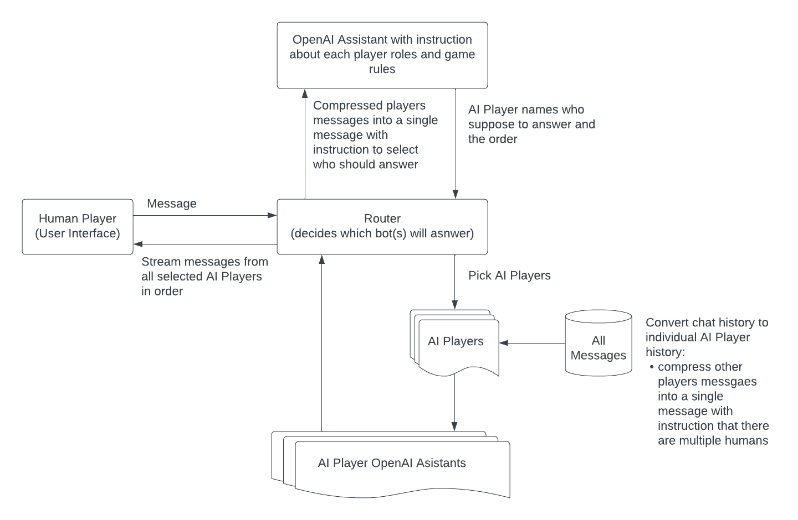

# Mafia with AI

I'm building the [Mafia party-game](https://en.wikipedia.org/wiki/Mafia_(party_game)) with AI bots.

Bots are not aware of each other. Each of them gets instructions to pretend to be a human and to hide their true identity. Bots are aware of their roles, their teammates and the game rules, so they have everything to play to win.
I also want to add some roleplay to the game so there is an ongoing conversation between all participants. There is a story and bots should develop it though the conversation and their game actions. 

Below is an ugly design diagram of the idea. I'll improve it once I implemented the first version of the chatroom and see how it works. Currently, there are too many unknowns.



The stack I plan to use:
- OpenAI API with Assistants and Threads
- AWS Lambda functions to host the backend logic
- Redis (most probably in AWS) to store the chat history and the game state
- React Native for the frontend


# Setup

Rename the [.env.template](.env.template) file into `.env` and fill in the values.

### Run Redis

I prefer to run it with Docker Compose. There is a config in the root directory, just run it. You need to have docker and docker-compose installed.
   ```bash
   docker-compose up
   ```

### Run Python functions

The whole game logic is driven by few Python functions:
- `init_game` - creates a new game, generates the story, bot-players, assign random roles and save this all into Redis
- `talk_to_all` - reply tho the chat and get the game moving forward, saving the state to Redis

I don't have any better runner than Python junit tests for now. In future, I'll use a web server with UI in React Native for the local development. I'll deploy functions to Lambdas and host UI somewhere separately.
Each function has a separate test. It does not make sense to run all of them, only for the function you want to run.
To run tests, install Python dependencies using `Pipenv` (more details about it is [below](#pipenv_setup)), then run a test you need.
   ```bash
   python -m unittest test_lambda_functions.TestGameFunctions.test_init_game
   ```

### <a id="pipenv_setup"></a>Pipenv setup and dependency installation

I use `pipenv` to manage dependencies. Install it, create a virtual environment, activate it and install dependencies.

1. Install `pipenv` using official [docs](https://pipenv.pypa.io/en/latest/install/#installing-pipenv). For example, on Mac:
    ```bash
    pip install pipenv --user
    ```

2. Add `pipenv` to PATH if it's not there. For example, I had to add to the `~/.zshrc` file the following line:
    ```bash
    export PATH="/Users/hiper2d/Library/Python/3.11/bin:$PATH"
    ```

3. Install packages and create a virtual environment for the project:
    ```bash
    cd <project dir> # navigate to the project dir
    pipenv install
    ```
   This should create a virtual environment and install all dependencies from `Pipfile.lock` file.

   If for any reason you need to create a virtual environment manually, use the following command:
    ```bash
    pip install virtualenv # install virtualenv if you don't have it
    virtualenv --version # check if it's installed
    cd <virtualenv dir> # for example, my virtual envs as here: /Users/hiper2d/.local/share/virtualenvs
    virtualenv <virtualenv name> # I usually use a project name
    ```

4. To swtich to the virtual environment, use the following command:
    ```bash
    cd <project dir>
    pipenv shell
    ```
   If this fails, then do the following:
    ```bash
    cd <virtualenv dir>/bin
    source activate
    ```