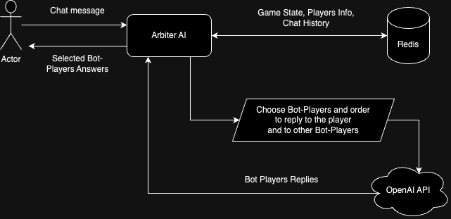

# Mafia with AI


I'm building the [Mafia party-game](https://en.wikipedia.org/wiki/Mafia_(party_game)) with AI bots. There is no UI yet,
it's a console version. It looks like this:

> ##### **** Day 1 begins! ****
>
> **[20:19:10] User**: Hey there, I'm Bob. I heard there is a Mafia among us. I think it's Mabel, I so whe tried to hind
> a gun under the table!
>
> **[20:20:07] Arbiter**: {"players_to_reply": ["Mabel", "Eleanor", "Emmett"]}
>
> **[20:20:20] Mabel**: Ah, greetings to you all! I'm Mabel, just another traveler on life's winding roads, always eager
> for a good yarn by the fireside. Emmett, your perspective fascinates me. There's indeed much to be learned from
> observing the plays of light and shadow, as you've put it. A keen observer can often see beyond the facade people hold
> up to the world. Lottie, your words resonate with me deeply. Life does love to test us with its storms, doesn't it?
> But
> it's in these very storms that we find our strength and, sometimes, a fresh start. And Eleanor, ah, a fellow
> storyteller! There's nothing like a good tale to warm the spirits. I believe every person, every situation holds a
> story
> waiting to be told, a mystery waiting to be unraveled.
>
> As for you, Bob, I must say, your accusation has quite the flavor of intrigue! But alas, if I were trying to conceal a
> weapon, I daresay I'd choose a less conspicuous method than under a table in such a convivial setting. My travels have
> taught me the value of peace and the importance of vigilance, but they've also instilled in me a profound respect for
> the sanctity of life and the pursuit of harmony. A gun, my dear Bob, is a tool I'd rather leave to the likes of old
> tales and legends. My weapons are my words, my observations, and the hope that, together, we can unravel any mystery,
> including this curious suspicion of Mafia amidst us. How about we all focus on sharing our stories and watching out
> for
> one another? After all, a united front is our best defense against any hidden threats, don't you think?
>
> **[20:20:34] Eleanor**: Ah, Mabel, your words do strike a chord - the art of deflection and painting oneself in the
> light of peace and harmony, all while navigating the accusations with the grace of a well-versed traveler. It's an
> intriguing stance, indeed. But Bob, you've certainly stirred the pot with your accusation, haven't you? Bringing a
> suspicion of Mafia into this cozy gathering adds a certain... spice to our interactions. While Mabel defends her
> innocence with eloquence, it's a reminder to us all that beneath the surface of camaraderie and shared tales, there
> might lurk deeper secrets. I say, let's not jump to conclusions too hastily. After all, in the grand game of life—and
> especially in a setting ripe with characters such as ours—assumptions can be as dangerous as the very threats we seek
> to
> uncover. Instead, why not delve deeper into what binds us here, beyond the storm and the warmth of the fire? Let's
> share
> more, observe more, and perhaps the truth will reveal itself in due time. Remember, the most captivating tales are
> those
> that unfold with patience and a keen eye for the essence beneath the facade.
>
> **[20:20:45] Emmett**: Emmett: Eleanor, your words are a testament to the complexity of the tapestry we find ourselves
> woven into this evening. Indeed, the sudden swirl of suspicion cast by Bob has added an unexpected hue to our
> gathering.
> While the storm howls outside, it seems a different tempest might be brewing within these walls—a tempest of mystery
> and
> intrigue. Mabel, your approach to the accusation was both calm and enlightening. It's a rare skill to navigate such
> waters with grace and wisdom. I find myself agreeing with the sentiment that our stories, observations, and the spirit
> of unity will be our guiding lights through this shadowed affair.
>
> And to you, Bob, your alertness is indeed commendable. In a world riddled with unseen dangers, it's the vigilant who
> often shepherd the flock to safety. Yet, as we stand at the crossroads of suspicion and fellowship, I suggest we tread
> carefully. The shadows cast by the flickering flames are many, and not all is as it appears. Let us share stories,
> yes,
> and let us observe. But let us also be mindful that in seeking the truth, we do not lose ourselves to the darkness of
> doubt and accusation without proof.
>
> As for myself, my journey to this saloon was one of escape from the clutches of my former life as a gambler. Yet, as
> fate would have it, it seems I've stumbled into a game far more intricate than any I've played before. A game where
> the
> stakes are not chips or cards, but trust and survival. Let us then proceed with both caution and curiosity, for in the
> end, it is not just the stories we tell, but the choices we make that define the course of this night.

Russian version (its very simple to play in any language):

> ##### **** Day 1 begins! ****
>
> **User**: Привет, я Боб. Я слышал, среди нас есть представители мафии. Клинт, кого ты подозреваешь?
>
> **Clint**: Привет, Боб. Интересный вопрос у тебя. Понимаю, что вопрос доверия в такой игре - это ключевой элемент. Но
> знаешь, пока я так на всех посмотрю, сложно сказать кто именно мог бы быть в числе мафии. Все представляются
> достаточно
> мирными жителями. Впрочем, стоит заметить, что Сайлас прибыл сюда со своим "таинственным прошлым", может, в его
> истории
> есть что-то, что он предпочитает держать в тени? Или Лотти, чьи истории могут служить хорошим прикрытием для более
> загадочных целей. Что думаешь, Боб?
>
> **User**: Я думаю, нам нужно кого-нибудь повесить, Клинт. Иначе я начну подозревать тебя!
>
> **Silas**: Сайлас: Клинт, интересно, что ты начал рассматривать меня и Лотти с такой подозрительностью. Мое прошлое,
> хоть и таинственное, не делает меня автоматически врагом. Все мы имеем что-то, от чего бежали или что оставили позади,
> ведь так? Этот салун – наше убежище от бури, как для тела, так и для души. Мы должны работать вместе, чтобы
> противостоять угрозам, а не поддаваться паранойе. Каждое обвинение должно быть обосновано доказательствами, а не
> предположениями. Боб, считаю, вешать кого-то сейчас было бы поспешным и опрометчивым решением. Мы должны тщательно
> исследовать и анализировать подозрения, прежде чем принимать какие-либо меры.
>
> **Lottie**: Клинт, Боб, Сайлас, я согласна с вами в том, что доверие является фундаментом нашего выживания и
> взаимопонимания в такие темные времена. Здесь, в этом уютном, хоть и загадочном салуне, мы все стоим перед лицом бури
> не
> только за его стенами, но и внутри нас самих. Сайлас право - поспешные обвинения и действия могут навредить нашему
> обществу больше, чем скрытая угроза мафии. Нам следует проявлять осторожность и внимательность к деталям, прежде чем
> делать выводы. Каждый из нас принес с собой свою историю, а моя задача - слушать и пытаться понять каждого, быть
> может,
> так мы сможем распознать истинное лицо угрозы. Мои истории действительно могут стать прикрытием, Клинт, но они же и
> способ соединить нас, вспомнить о том, что даже в самые темные времена мы можем найти свет. Пока что я не вижу
> достаточных оснований для обвинений, но предлагаю всем быть более наблюдательными.
>
> **User**: Ребят, не вмешивайтесь. Это между мной и Клинтом
>
> **Clint**: Боб, я понимаю твой настрой и желание действовать немедленно. Однако как ты сам заметил, нас всех
> объединяет общая цель – выживание в этих непростых условиях. Мое внимание к деталям и ситуации с Сайласом и Лотти не
> более чем попытка прояснить обстановку и защитить наше сообщество от возможных угроз. Прежде чем делать выводы, я
> предпочитаю анализировать имеющиеся факты и наблюдения - это часть моего характера и моего способа контролировать
> ситуацию. Твое предложение "повесить кого-нибудь" без тщательного рассмотрения может привести нас к нежелательным
> последствиям. Нам нужно действовать обдуманно и совместно строить нашу стратегию. Давай не будем спешить с выводами и
> дадим каждому возможность высказаться. Начнем с поиска доказательств и постараемся составить понимание того, что на
> самом деле происходит. Уверен, если мы будем действовать вместе, то сможем принять правильное решение.

Bot-players are not aware of each other. Each of them gets instructions to pretend to be a human and to hide their true
identity. Bots are aware of their roles, their teammates and the game rules, so they have everything to play to win.
I also want to add some roleplay to the game so there is an ongoing conversation between all participants. There is a
story and bots should develop it though the conversation and their game actions.

# Design and Stack

The main game flow is a chat between the human player and bot-players. The chat is sequential (not a real-time). Then a
user player posts something, the game arbiter AI decides which bot-players, how manu and in what order will reply to
that.



The stack I plan to use:

- OpenAI API with Assistants and Threads
- AWS Lambda functions to host the backend logic
- Redis (most probably in AWS) to store the chat history and the game state
- React Native for the frontend

Redis collections I use:

- STRING: game state with OpenAI assistant and thread ids for Arbiter and Bot-Players
- SORTED_SET: timestamp of each game so I know when they were created
- LIST: chat history; arbiter and each Bot-Player maintains the latest row in this history it saw, so the remaining
  messages can be sent to the personal OpenAI player's thread each time they need to reply

# The game logic

Right now the whole game is in just few functions. They imitate backend endpoints (I plan to use AWS lambda but to be
able to run locally as REST endpoints on a local web server). There is no client yet.

- init_game

        This function creates a new game, generates the story, bot-players, assign random roles and save this all into Redis. It
        also creates OpenAI assistants for the game master (arbiter) and bot-players. Each assistant has a separate OpenAI
        thread. They are saved into the game object in Redis. If the game stops, its state is saved and can be continued at any
        moment.
        
        Each bot-player knows their name, a personal story, and a secret role. They are instructed not to reveal roles and
        follow personal stories during the conversation. Bots know names and stories each other. I plan to add characters later.
        
        Right now lots of stuff is hardcoded but I want all the stories to be generated by AI. Bots know the rules of the game
        and should try to win. Winning conditions are different for different roles. I plan to update bot assistants'
        instructions during the game so they always aware of the current game state (which day, who is alive, who is the main
        suspect, etc.). Bots are instructed that they are talking to multiple human players. They should also pretend to be
        humans and to hide their true identity.


- get_welcome_messages_from_all_players_async

        Asks each bot player to generate a welcome message. All bots introduce themselves acynchronously


- ask_everybody_to_introduce_themself_in_order

        An alternative to the previous function, but players introduce themselves one by one. Each next player 
        know what previous plyaers said and can reference them 


- talk_to_all

        This is there the game begins. A user sends some message to the chat to other players.
        The message is received by the Arbiter AI whose responsibility it to get all the latest messages and to decide which
        bot-players should reply. Then bot-assistants reply one by one. They don't know about the arbiter AI and think that this
        is just the conversation going. They instructed to accept input from multiple players at a time.
        
        The function returns a list of replies from one or more bot-players. The game state is updated and saved to Redis.
        Arbiter AI will need those messages to have the complete history of the conversion. It will also be needed for UI in the
        future.


- talk_to_certain_player

        This lambda is called after the `talk_to_all` function by the client to get actual reponses from the bot-players


- start_elimination_vote_round_one_async

        This function asks each player-bot to vote. They must provide one name and a reson for debugging purposes.
        The function calculates 2-3 leaders and adds a message to the Redis list history to everyone about the first
        round of vote results. The game state is updated and saved to Redis. 

        The function received a user_message which is a vote for a player.

        The voting is a secret at the moment. It should be open in future but I need to think how to decide on the order


- ask_bot_player_to_speak_for_themselves_after_first_round_voting

        A bot-player who is a leader is beang asked to speak for themself after the first round of voting.


- let_human_player_to_speak_for_themselves

        Same as the previous function but for a human player.


- start_elimination_vote_round_two

        The same as the first round of voting but only among the first round leaders. The function calculates the final
        result and updates all promts that this player is dead now. Post a message to che chat about that with 
        the player's role. In case of a tie randomly pick the victim but in future it should be decided by some game 
        roles.


- start_game_night

        Starts the game night. Not yet implemented.


- etc

        The logic of what function to call will be implemented on the client side. Most of game stages go one after another in a
        strict order. The only flexible stage is the day discussion. Somehow I need to decide when to end it and to start the
        next stages and eventually a new day.


After that the game will be complete. Sounds like I should have something playable in few weeks :beer:

# Setup

### Run Redis

I prefer to run it with Docker Compose. There is a config in the root directory, just run it. You need to have docker
and docker-compose installed.

```bash
docker-compose up
```

### Run Python functions

Before running Python code, rename the [.env.template](.env.template) file into `.env` and fill in the values. All
environmental variables from it will be loaded by functions and used to talk to the external APIs (Redis, OpenAI).

I don't have any better runner than Python junit tests for now. In future, I'll use a web server with UI in React Native
for the local development. I'll deploy functions to Lambdas and host UI somewhere separately.
Each function has a separate test. It does not make sense to run all of them, only for the function you want to run.
To run tests, install Python dependencies using `Pipenv` (more details about it is [below](#pipenv_setup)), then run a
test you need like this:

   ```bash
   python -m unittest test_lambda_functions.TestGameFunctions.test_init_game
   ```

### <a id="pipenv_setup"></a>Pipenv setup and dependency installation

I use `pipenv` to manage dependencies. Install it, create a virtual environment, activate it and install dependencies.

1. Install `pipenv` using official [docs](https://pipenv.pypa.io/en/latest/install/#installing-pipenv). For example, on
   Mac:
    ```bash
    pip install pipenv --user
    ```

2. Add `pipenv` to PATH if it's not there. For example, I had to add to the `~/.zshrc` file the following line:
    ```bash
    export PATH="/Users/hiper2d/Library/Python/3.11/bin:$PATH"
    ```

3. Install packages and create a virtual environment for the project:
    ```bash
    cd <project dir> # navigate to the project dir
    pipenv install
    ```
   This should create a virtual environment and install all dependencies from `Pipfile.lock` file.

   If for any reason you need to create a virtual environment manually, use the following command:
    ```bash
    pip install virtualenv # install virtualenv if you don't have it
    virtualenv --version # check if it's installed
    cd <virtualenv dir> # for example, my virtual envs as here: /Users/hiper2d/.local/share/virtualenvs
    virtualenv <virtualenv name> # I usually use a project name
    ```

4. To swtich to the virtual environment, use the following command:
    ```bash
    cd <project dir>
    pipenv shell
    ```
   If this fails, then do the following:
    ```bash
    cd <virtualenv dir>/bin
    source activate
    ```